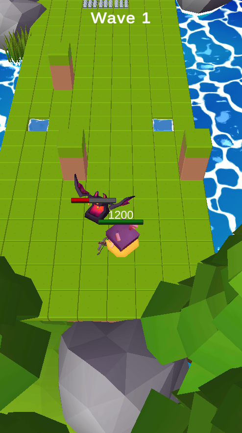
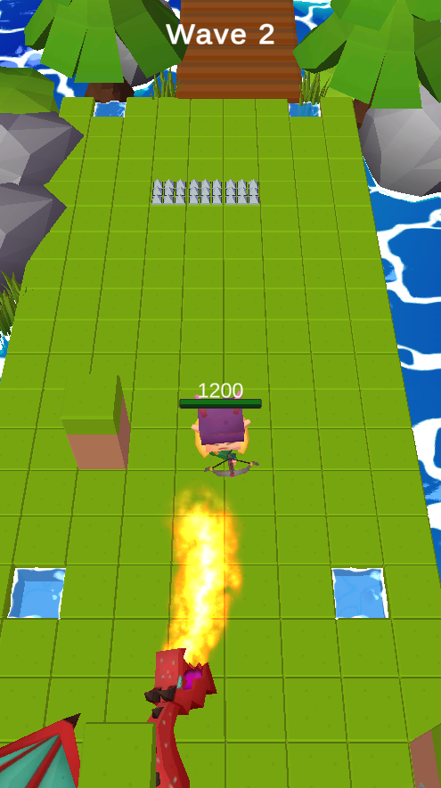

Test/Demo project I created back in 2020 and updated in 2025/2026. Based on the mobile game "Archero" look and mechanic-wise.
- Player character shoots arrows at the nearest enemy automatically when standing still
- Enemies have different EnemyBehaviourActions specified in their EnemyConfigs, e.g. idle actions, attack or movement actions
- Some actions have subtypes, e.g. movement: some enemies will move straight towards the player, others will periodically become invisible to avoid getting hit
- There's only one "room" where players fight against one wave of random enemies after another
- The "room" consists of different tiles and is build dynamically at the start of a run according to floor configs defining which tiles are supposed to be placed where (e.g. grass or water tiles or special tiles like walls or traps)
- Configs were initially hosted as google spreadsheets on google drive and imported as .json via editor tools
- Art Assets folder is hidden and not available as it contains paid assets, so there will be errors if you attempt to open the project in Unity!
- Current Unity version: 2022.3.62f1 

  
  

https://github.com/user-attachments/assets/95f42907-1b75-426b-a6f7-509b54d6aecc

To Do's:

[ ] Update to Unity version 6.3 LTS

[ ] Update UI, look into using UI Toolkit instead for practice

[ ] Add some more rooms and ability to progress from one room to another.

[ ] Player skills to activate other than relying on the base attack

Contains the following asset store packages: 

Joystick Pack : https://assetstore.unity.com/packages/tools/input-management/joystick-pack-107631

Environment Assets: https://assetstore.unity.com/packages/3d/environments/landscapes/lowpoly-style-free-rocks-and-plants-145133

Toon Enemies: https://assetstore.unity.com/packages/3d/characters/toon-enemies-pack-01-1st-generation-50421

Toon Characters: https://assetstore.unity.com/packages/3d/characters/toon-heroes-pack-161154

Toon shader is a simplified version by me but based on Dustyrooms FlatKit (https://assetstore.unity.com/packages/vfx/shaders/flat-kit-toon-shading-and-water-143368).

